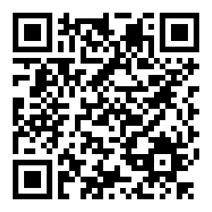

Aplikacija je deo projektnog rada na predmetu TZRM.

Aplikacija se konektuje na predefinisani server i razmenjuje podatke u JSON formatu putem HTTPS protokola. (Konekcija na neki drugi server moze dati nepredvidjene rezultate)

Postoji mogućnost prikaza detalja serverskog sertifikata.

 